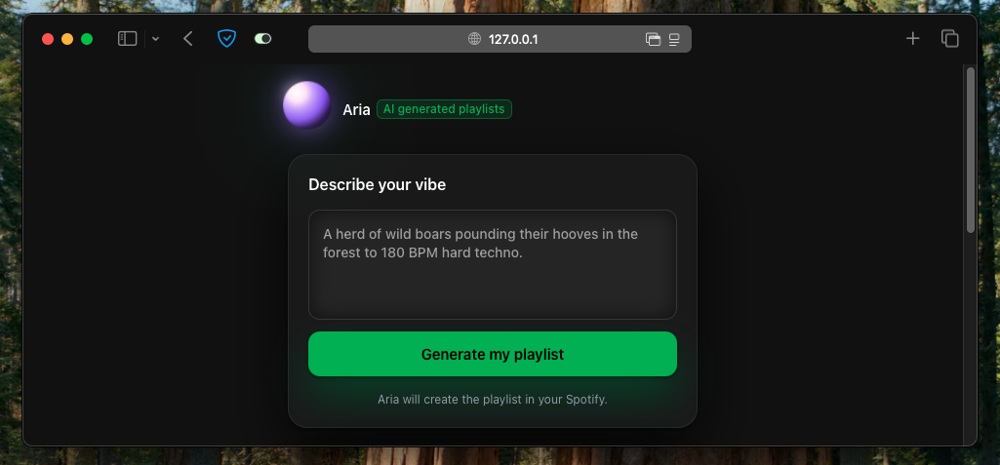

# Aria : Spotify playlist agent

Generate Spotify playlists from free-form prompts.



Aria is an AI agent that has access to Spotify's API to create for you any playlist based on a prompt, directly into your spotify account.
Input a mood, vibe, situation, or whatever you'd like and Aria will do its best to craft a tailor made playlist matching your prompt. 

## Features
- Spotify OAuth flow with automatic token refresh.
- Playlist generation powered by OpenAI with function calling.
- Modern single-page UI with dynamic loading overlay.
- Modular Flask application factory.

## Getting Started
1. **Install dependencies**
   ```bash
   python -m venv .venv
   source .venv/bin/activate
   pip install -r requirements.txt
   ```
2. **Configure environment**
   - Copy `.env.example` to `.env`.
   - Fill in Spotify and OpenAI credentials.
   - Update `SPOTIFY_REDIRECT_URI` to match your domain (e.g. `https://your-app.com`).
3. **Run locally**
   ```bash
   flask --app app run --host 127.0.0.1 --port 3000 --debug
   ```

